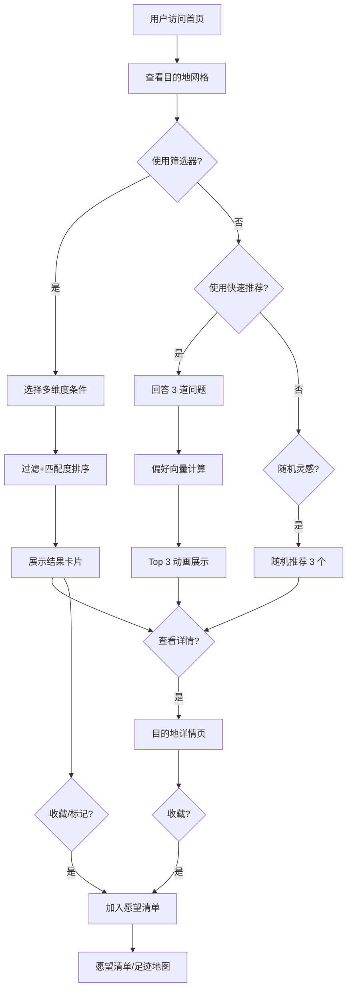

## 1. 产品概述

旅行灵感目的地探索平台，帮助用户解决「不知道去哪玩」的选择难题。通过预算、季节、天数、主题、签证、飞行时长等多维度筛选 100+ 精选目的地，结合快速推荐问答、随机灵感、愿望清单与足迹地图，提供媲美 Lonely Planet + Skyscanner Everywhere 的一站式灵感体验。

- 目标用户：旅行爱好者、计划出行但目的地未定的用户
- 核心价值：降低决策成本，激发旅行灵感，个性化匹配目的地

## 2. 核心功能

### 2.1 用户角色

| 角色 | 注册方式 | 核心权限 |
|------|----------|----------|
| 游客 | 无需注册 | 浏览目的地、筛选、快速推荐、随机灵感 |
| 本地用户 | localStorage 持久化 | 收藏愿望清单、标记足迹、保存偏好 |

### 2.2 功能模块

1. **首页（目的地网格）**：Hero 区域、多条件筛选器、目的地卡片网格、排序切换、地图模式切换
2. **目的地详情页**：大图轮播、最佳月份图表、亮点推荐、实用信息、类似目的地
3. **快速推荐 Quiz**：3 道选择题 → 匹配度计算 → Top 3 推荐动画展示
4. **愿望清单页**：收藏目的地列表、分类筛选、批量操作、分享截图
5. **足迹地图页**：世界地图可视化、想去/去过分布、随机灵感按钮

### 2.3 页面详情

| 页面名称 | 模块名称 | 功能描述 |
|----------|----------|----------|
| 首页 | Hero 区域 | 标题、副标题、搜索框、随机灵感按钮、快速推荐入口 |
| 首页 | 筛选器面板 | 8 类筛选条件（预算/月份/天数/主题/飞行时长/签证/热度/季节限定） |
| 首页 | 排序控制 | 匹配度降序、预算低→高、飞行时长短→长、推荐指数 |
| 首页 | 目的地卡片网格 | 封面图、标签、评分、快速信息、收藏/足迹切换 |
| 首页 | 地图模式 | 世界地图散点 balloon 显示匹配结果 |
| 目的地详情 | 大图轮播 | Unsplash 图片列表轮播 |
| 目的地详情 | 最佳月份图表 | 12 个月柱状图/热力图 |
| 目的地详情 | 亮点列表 | 3-5 个必做/必吃/必看 |
| 目的地详情 | 实用信息 | 货币、语言、插头、时区、安全等级 |
| 目的地详情 | 类似推荐 | 基于主题/标签的推荐 |
| 快速推荐 | 问题卡片 | 逐题展示、A/B 双选项、进度指示 |
| 快速推荐 | 结果页 | Top 3 匹配目的地、匹配百分比、动画呈现 |
| 愿望清单 | 列表视图 | 已收藏/已去过 Tab、卡片网格 |
| 足迹地图 | 世界地图 | SVG 世界地图 + 城市坐标标记 + 颜色区分状态 |

## 3. 核心流程

### 3.1 筛选匹配流程
用户打开首页 → 选择筛选条件 → 系统按条件过滤目的地数组 → 计算每条匹配度得分 → 按得分排序 → 渲染卡片网格 → 用户切换排序/地图模式

### 3.2 快速推荐流程
进入 Quiz 页 → 回答第 1 题（海滩 vs 城市）→ 回答第 2 题（预算）→ 回答第 3 题（天数）→ 计算偏好向量 → 对 100+ 目的地打分 → 展示 Top 3 动画 → 跳转详情或回到首页

### 3.3 愿望清单流程
浏览卡片 → 点击心形图标 → 添加到 localStorage wishlist → 导航栏角标更新 → 进入愿望清单页 → 查看/删除/标记已去过

## 4. 用户界面设计

### 4.1 设计风格

- **主色调**：深海蓝 `#0C4A6E`（旅行探索感）+ 珊瑚橙 `#F97316`（活力强调）+ 沙米色 `#FEF3C7`（温暖底色）
- **辅助色**：薄荷绿 `#10B981`（免签/推荐）、玫瑰红 `#F43F5E`（收藏）、琥珀黄 `#F59E0B`（热度）
- **按钮风格**：圆角 16px，悬浮微放大 + 阴影扩散，珊瑚橙主按钮配白色文字
- **字体**：标题用 "Fraunces" 衬线体（优雅有格调），正文用 "Plus Jakarta Sans" 无衬线（现代清爽）
- **布局风格**：卡片瀑布流 + 侧边筛选抽屉，大量留白，圆角卡片 + 柔和阴影
- **图标**：Lucide React 线性图标，季节主题用 emoji 点缀
- **整体气质**：旅游杂志风（Lonely Planet 感）+ 现代 Web 交互（Skyscanner 感），温暖治愈又精致高级

### 4.2 页面设计概览

| 页面名称 | 模块名称 | UI 元素 |
|----------|----------|----------|
| 首页 | Hero 区域 | 渐变叠加封面图、超大衬线标题、搜索框带图标、CTA 按钮群、浮动标签云 |
| 首页 | 筛选器面板 | 折叠式分组、chip 多选、滑块控件、悬浮 tooltip、重置按钮 |
| 首页 | 目的地卡片 | 封面图渐变遮罩 + 标题浮层、标签 chip、评分条（三色）、心形/脚印按钮悬浮显示 |
| 首页 | 地图模式 | 世界地图 SVG、城市坐标 balloon、点击 balloon 出卡片预览、缩放拖动 |
| 目的地详情 | 大图轮播 | 100vh 首屏全屏图、小圆点指示器、左右切换、平滑过渡 |
| 目的地详情 | 最佳月份图表 | 热力矩阵 4×3 格子、颜色深浅代表推荐度、悬浮 tooltip |
| 目的地详情 | 亮点列表 | 图标 + 标题 + 描述、交替左右布局、配图小缩略图 |
| 快速推荐 | 问题卡片 | 居中大卡片、A/B 双列对比、Emoji 配图、进度条顶部、过渡动画 |
| 快速推荐 | 结果页 | 三张卡片错落入场动画、匹配度环形进度条、彩带 confetti |
| 愿望清单 | 列表 | Tab 切换、空状态插画、卡片拖拽排序（可选）、批量删除 |
| 足迹地图 | 世界地图 | 深色底海洋 + 浅色大陆、想去绿色点、去过红色点、悬浮 tooltip |

### 4.3 响应式设计

- 桌面优先（1440px 基准），平板 1024px、移动 768px / 375px 适配
- 筛选器桌面端左侧固定抽屉，移动端底部滑出 sheet
- 网格：桌面 4 列、平板 3 列、移动 1-2 列
- 地图模式桌面端全屏，移动端可切换到列表模式
- 触控优化：按钮最小 44×44px，chip 间距加宽

### 4.4 动效设计

- 页面加载：卡片错落 fade-in-up（stagger 50ms）
- 卡片悬浮：1.02 缩放 + y:-4px + 阴影加深，150ms ease-out
- 筛选器切换：条件更新后列表 smooth re-layout（FLIP 动画）
- Quiz 转场：水平 slide，旧问题左滑出 + 新问题右滑入
- 收藏按钮：心形 click → 弹出 ❤️ emoji particle 向上飘散
- Top 3 结果：卡片依次 rotate-in + bounce，环形进度条 0→value 数字动画
