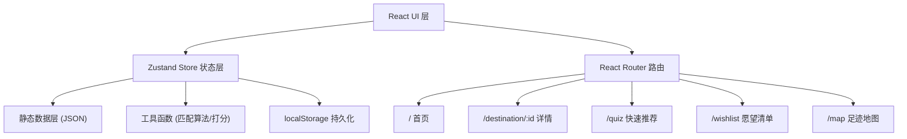

## 1. 架构设计



## 2. 技术说明

- **前端框架**：React 18 + TypeScript 5
- **构建工具**：Vite 6
- **样式方案**：TailwindCSS 3 + CSS 变量主题系统
- **路由**：React Router 7
- **状态管理**：Zustand 5（筛选状态、愿望清单、足迹）
- **图标库**：Lucide React
- **工具函数**：clsx + tailwind-merge（className 合并）
- **数据源**：本地静态 JSON（100+ 精选目的地）
- **持久化**：localStorage（愿望清单、足迹、筛选偏好）
- **图片源**：Unsplash Source URL（动态获取）
- **地图**：自定义 SVG 世界地图（无需第三方库）

## 3. 路由定义

| 路由 | 页面组件 | 用途 |
|------|----------|------|
| `/` | `pages/Home.tsx` | 首页：目的地网格 + 筛选器 + 排序 + 地图模式 |
| `/destination/:id` | `pages/DestinationDetail.tsx` | 目的地详情：轮播 + 图表 + 亮点 + 实用信息 |
| `/quiz` | `pages/Quiz.tsx` | 快速推荐：3 道题 → Top 3 结果 |
| `/wishlist` | `pages/Wishlist.tsx` | 愿望清单：收藏/已去过列表 |
| `/map` | `pages/FootprintMap.tsx` | 足迹地图：世界地图可视化 |

## 4. 数据模型

### 4.1 Destination 类型定义

```typescript
interface Destination {
  id: string;
  name: string;
  nameEn: string;
  country: string;
  continent: 'asia' | 'europe' | 'americas' | 'africa' | 'oceania' | 'middle-east';
  tagline: string;
  description: string;
  coverImage: string;
  gallery: string[];
  tags: ('beach' | 'ancient-city' | 'nature' | 'food' | 'adventure' | 'family' | 'honeymoon' | 'solo-friendly' | 'city' | 'ski' | 'road-trip')[];
  seasonalTags?: ('cherry-blossom' | 'lavender' | 'aurora' | 'red-leaves')[];
  ratings: {
    languageFriendly: number;   // 0-10
    safety: number;             // 0-10
    priceIndex: number;         // 1-3
  };
  bestMonths: number[];          // 1-12
  suggestedDays: { min: number; max: number };
  budgetLevel: 1 | 2 | 3;        // 1=¥ 经济, 2=$$ 中档, 3=$$$ 奢华
  flightHoursFromShanghai: number;
  visaType: 'visa-free' | 'visa-on-arrival' | 'e-visa' | 'visa-required';
  popularity: 'hot' | 'niche' | 'cold';
  highlights: { type: 'do' | 'eat' | 'see'; title: string; desc: string; }[];
  practical: {
    currency: string;
    language: string;
    plug: string;
    timezone: string;
    safetyLevel: 'low' | 'medium' | 'high';
  };
  coordinates: { lat: number; lng: number };
  similarDestinations: string[];  // Destination IDs
  recommendScore: number;         // 0-100 总体推荐指数
}
```

### 4.2 FilterState 类型

```typescript
interface FilterState {
  budgetLevels: (1 | 2 | 3)[];
  months: number[];
  dayRanges: ('3-5' | '5-7' | '7-10' | '10+')[];
  themes: string[];
  flightDurations: ('<2h' | '2-5h' | '5-10h' | '10h+')[];
  visaTypes: string[];
  popularity: string[];
  seasonalTags: string[];
  searchQuery: string;
  sortBy: 'match' | 'budget-asc' | 'flight-asc' | 'recommend';
}
```

### 4.3 UserState 类型

```typescript
interface UserState {
  wishlist: string[];       // 收藏的 destination ids
  visited: string[];        // 已去过的 destination ids
  quizAnswers: { q1?: 'A' | 'B'; q2?: 'A' | 'B'; q3?: 'A' | 'B' };
}
```

## 5. 目录结构

```
src/
├── data/
│   └── destinations.ts       # 100+ 目的地静态数据
├── store/
│   ├── useFilterStore.ts     # 筛选状态
│   └── useUserStore.ts       # 用户状态（愿望清单/足迹）
├── utils/
│   ├── matchScore.ts         # 匹配度算法
│   ├── quizRecommend.ts      # Quiz 推荐算法
│   └── formatters.ts         # 格式化工具
├── components/
│   ├── layout/
│   │   ├── Navbar.tsx
│   │   └── Footer.tsx
│   ├── filters/
│   │   ├── FilterPanel.tsx
│   │   └── FilterChip.tsx
│   ├── destination/
│   │   ├── DestinationCard.tsx
│   │   ├── DestinationGrid.tsx
│   │   ├── RatingBar.tsx
│   │   └── SortControls.tsx
│   ├── map/
│   │   ├── WorldMap.tsx
│   │   └── MapBalloon.tsx
│   ├── quiz/
│   │   ├── QuizQuestion.tsx
│   │   └── QuizResult.tsx
│   └── common/
│       ├── HeartButton.tsx
│       ├── ImageCarousel.tsx
│       └── EmptyState.tsx
├── pages/
│   ├── Home.tsx
│   ├── DestinationDetail.tsx
│   ├── Quiz.tsx
│   ├── Wishlist.tsx
│   └── FootprintMap.tsx
├── App.tsx
├── main.tsx
└── index.css
```

## 6. 匹配度算法设计

### 6.1 筛选匹配
对每个筛选条件，命中 +10 分，部分命中 +5 分，完全不命中则过滤掉。

### 6.2 排序加权
- `match`：总匹配分 + 推荐指数 × 0.3
- `budget-asc`：按 budgetLevel 升序
- `flight-asc`：按 flightHoursFromShanghai 升序
- `recommend`：按 recommendScore 降序

### 6.3 Quiz 偏好向量
```
q1=海滩:  偏好 beach=2, nature=1, 主题得分加成
q1=城市:  偏好 city=2, food=1, ancient-city=1
q2=精打细算: 偏好 budgetLevel=1
q2=不太计较: 偏好 budgetLevel=[2,3]
q3=3-5天:   偏好 suggestedDays.min<=5
q3=10天:    偏好 suggestedDays.max>=10
```

## 7. 性能优化

- 目的地数据使用 useMemo 缓存筛选结果
- 卡片列表使用 React key 优化 re-render
- 图片使用 loading="lazy" + Unsplash w 参数控制尺寸
- Zustand selector 避免不必要的组件重渲染
- CSS transforms 实现硬件加速动画
